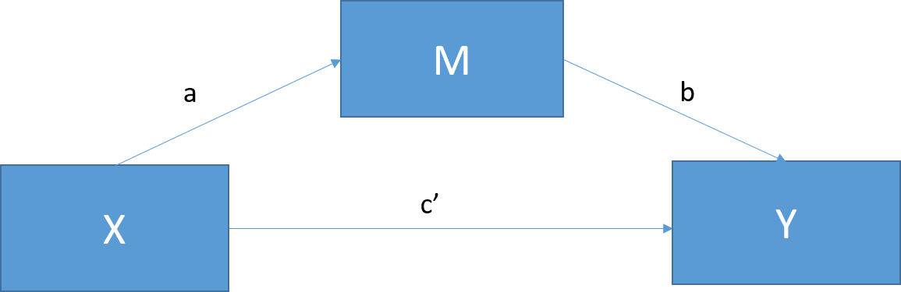

```{r setup, include=FALSE}
knitr::opts_chunk$set(
  echo = TRUE,
  message = FALSE,
  warning = FALSE,
  fig.width = 5,
  fig.height = 3.75,
  fig.align = "center"
)
```

::: {.callout-warning title="Historical Lecture"}
This chapter has not yet been adapted to match the format and style of the rest of the book. It is included in its original lecture structure for readers who need to conduct and interpret a mediation analysis.
:::

## Mediation

- Baron and Kenny (1986) had 66,271 citations as of March 27, 2017.
- See [Kenny's mediation page](https://davidakenny.net/cm/mediate.htm) for useful information.
- Mediation is extremely common in social psychology and is now used throughout psychology.

- Baron and Kenny define moderator and mediator as follows:

> "The moderator function of third variables, which partitions a focal independent variable into subgroups that establish its domains of maximal effectiveness regarding a given dependent variable"

> "The mediator function of a third
variable, which represents the generative mechanism through
which the focal independent variable can influence the
dependent variable of interest"

- In short, the mediator describes a pathway through which $X$ may be related to $Y$.
- Having one mediator is called simple mediation.



Preacher and Hayes (2008) explain that the relationship between $X$ and $Y$ can be separated into the direct effect $c'$ and the indirect effect through $M$. Path $a$ represents the relationship between $X$ and $M$, path $b$ represents the relationship between $M$ and $Y$ while controlling for $X$, and the indirect effect is the product $ab$.

- Mediation attempts to explain part of the total relationship through an indirect path.


- We can connect the total effect to simple mediation:
$$c = c' + ab$$

$$total = direct + indirect $$

### A Hypothetical Example of Mediation

- Children with the ability to delay gratification tend to be more successful later in life, as illustrated by the marshmallow test.
- You hypothesize that their trust in authority figures to keep promises is an intermediate step in the pathway to later success.
- You collect data from 268 four-year-olds and give them the marshmallow test, measuring how long they wait before eating the marshmallow. Rather than waiting 20 years, you operationalize success as performance on a kindergarten entrance exam at the end of the year. You also measure how much they trust authority figures on a 1-to-10 scale using an established battery for children.


```{r, echo=TRUE, warning=FALSE}
library(car)
set.seed(42)
# For simulation of mediation steps see Hallgren, 2013
# path a strength
a=.4
# path b strength
b=.4
# path c' strength
cp=.01
# people
n <- 268
# Normal distribution of time (mins)
X <- rnorm(n, 5, 2)
# Mediator
M <- a*X+rnorm(n, 0, 1)
# Our equation to  create Y
Y <- cp*X + b*M + rnorm(n, sd=1)
#Built our data frame
Marshmallow.Data<-data.frame(Success=Y,Time=X,Trust=M)
# plots
scatterplot(Success~Time, data= Marshmallow.Data, smoother=FALSE)
scatterplot(Success~Trust, data= Marshmallow.Data, smoother=FALSE)
scatterplot(Trust~Time, data= Marshmallow.Data,smoother=FALSE)
```


#### Baron and Kenny Steps for Testing Mediation

- Step 1: Test $Y \sim X$.
- Is there a relationship? In the traditional procedure, you proceeded only if the total effect was significant. Modern mediation analysis does not require a significant total effect before testing the indirect effect.

```{r, echo=TRUE, warning=FALSE}
Model.1<-lm(Success~Time, data= Marshmallow.Data)
summary(Model.1)
```

- Step 2: Test $M \sim X$.
- This model estimates path $a$.

```{r, echo=TRUE, warning=FALSE}
Model.2<-lm(Trust~Time, data= Marshmallow.Data)
summary(Model.2)
```

- Step 3: Test $Y \sim M + X$.
- This model estimates path $b$ while controlling for $X$ and estimates the direct effect $c'$ while controlling for $M$.

```{r, echo=TRUE, warning=FALSE}
Model.3<-lm(Success~Trust+Time, data= Marshmallow.Data)
summary(Model.3)
```

- Step 4: Inspect $c'$ in Model 3 and test the indirect effect $ab$ directly.
- Historically, researchers used the labels *complete mediation* when $c'$ was no longer significant and *partial mediation* when $c'$ remained significant but became smaller. These labels depend too heavily on sample size and are no longer recommended as the main conclusion.

#### Interpretation

- In this simulation, the direct path $c'$ is close to zero.
- Time is not significant in Model 3, but it could be significant in a larger sample.
- The data are consistent with part of the relationship between time and success operating through trust.
- How do we test the indirect effect, path $ab$?

#### Significance of the Indirect Path

- In our example, paths $a$ and $b$ are both strong and significant. This is called joint significance.
- Joint significance provides evidence consistent with an indirect effect, but we should test and report the indirect effect directly.
- The Sobel test estimates the standard error of $ab$ in the equation $c = c' + ab$ and tests the product against zero.
- The Sobel test relies on a normal approximation for the product $ab$. That sampling distribution is often asymmetric, especially in smaller samples, so the test can have low power.
- Other tests exist, but the Sobel test was the most common in its day.

```{r, echo=TRUE, warning=FALSE}
library(bda)
mediation.test(Marshmallow.Data$Trust,Marshmallow.Data$Time,Marshmallow.Data$Success)
```

- Bootstrapping has largely replaced the Sobel test, so we will focus on bootstrap intervals in the examples.
- Two common bootstrap intervals are the bias-corrected and accelerated (BCa) interval and the percentile interval.
- Their performance differs across situations; the important point is to name the interval you use and report the number of bootstrap draws.

\pagebreak

##### The `mediation` Package in R

- You need Model 2 ($M \sim X$) and Model 3 ($Y \sim M + X$) from above.
- The terminology changes because this package can handle larger designs with control variables and several types of regression models.
 
```{r, echo=TRUE, warning=FALSE}
library(mediation)
Med.Boot.BCa <- mediate(Model.2, Model.3, boot = TRUE, 
                        boot.ci.type = "bca", sims=200, treat="Time", mediator="Trust")
summary(Med.Boot.BCa)
plot(Med.Boot.BCa)
```

- ACME: average causal mediation effect [total effect - direct effect]
- ADE: average direct effect [total effect - indirect effect]
- Total Effect = Direct (ADE) + Indirect (ACME) 
- These are unstandardized effects
- Proportion mediated: conceptually, ACME / total effect
- Note: I used 200 simulations to keep this lecture example quick, but use substantially more for a real analysis.

- By changing the code, we can request a percentile interval instead of BCa.

```{r, echo=TRUE, warning=FALSE}
Med.Boot.perc <- mediate(Model.2, Model.3, boot = TRUE, 
                         boot.ci.type = "perc", sims=200, treat="Time", mediator="Trust")
summary(Med.Boot.perc)
plot(Med.Boot.perc)
```

- These results align with the pattern from the regression steps.
- One benefit is that the package can accommodate several kinds of mediator and outcome models.
- More complicated mediation models may require additional packages or custom code.

#### Testing the Mediator as a Moderator?
- Could it be that our mediator is really just a moderator?

### Power

- When you plan a mediation analysis, think carefully about the power you will need.
- Indirect effects are products of coefficients and often require larger samples than expected.
- Kenny developed an [application for estimating power in simple designs](https://davidakenny.shinyapps.io/MedPower/).
- Larger designs may require custom simulations. The `powerMediation` package can help with some designs.

### Partial Mediation

- Historically, *partial mediation* referred to a pattern in which the direct and indirect effects were both present.
- Low power can make the labels *complete* and *partial* unstable.
- Following Hayes (2013), avoid making the main conclusion that mediation is complete or partial. Report the direct and indirect effects with their uncertainty.
- Below, I created a simulation with power near .80 to examine both effects.

```{r, echo=TRUE, warning=FALSE}
library(car)
set.seed(42)
# For simulation of mediation steps see Hallgren, 2013
# path a strength
a=.4
# path b strength
b=.4
# path c' strength
cp=.2
# people
n <- 177
# Normal distribution of time (mins)
X <- rnorm(n, 5, 2)
# Mediator
M <- a*X+rnorm(n, 0, 1)
# Our equation to  create Y
Y <- cp*X + b*M + rnorm(n, sd=1)
#Built our data frame
Marshmallow.Data.Part<-data.frame(Success=Y,Time=X,Trust=M)

Part.Model.2<-lm(Trust~Time, data= Marshmallow.Data.Part)
summary(Part.Model.2)

Part.Model.3<-lm(Success~Trust+Time, data= Marshmallow.Data.Part)
summary(Part.Model.3)

Part.Med.Boot.BCa <- mediate(Part.Model.2, Part.Model.3, boot = TRUE,
                             boot.ci.type = "bca", sims=200, treat="Time", mediator="Trust")
summary(Part.Med.Boot.BCa)
plot(Part.Med.Boot.BCa)
```
