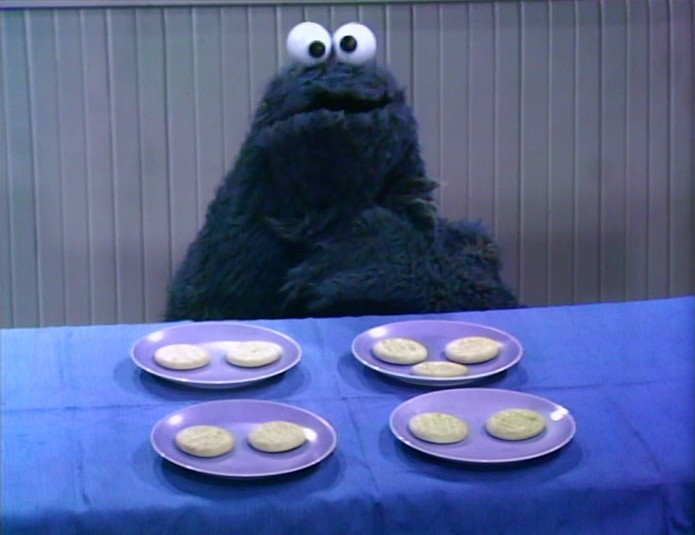

```{r setup, include=FALSE}
knitr::opts_chunk$set(
  echo = TRUE,
  message = FALSE,
  warning = FALSE,
  fig.align = "center",
  fig.width = 4.25,
  fig.height = 4
)
```

Note: Some complex R code was used to generate today's lecture. I have hidden it in the rendered chapter. If you see `echo = FALSE` inside the `.qmd` file, that code is not something you are expected to understand or learn. I will explain the functions you need to learn.

## Design Example
> We are interested in how much people trust a partner after engaging in different levels of joint action. Two people enter the lab, one of whom is a confederate. They are asked to either (a) move chairs independently, (b) move a couch together while the confederate helps, or (c) move a couch together while the confederate hinders. Moving a couch requires the two people to coordinate their actions. After the study ends, participants rate how trustworthy their partner seems from 1 to 7, with 7 indicating high trust.
  
No Joint Action | Helpful Joint Action | Disrupted Joint Action
----------------|----------------------|------------------------
2               | 5                    | 2
3               | 4                    | 3
5               | 7                    | 3
3               | 4                    | 1
2               | 5                    | 1
M = 3           | M = 5                | M = 2 
SS = 6          | SS = 6               | SS = 4 

### Comparing Three Groups
To use *t*-tests, I would have to compare G1 with G2, G2 with G3, and G1 with G3. This becomes a problem when I have four or more groups. Each additional test increases the risk of committing a Type I error. A dead salmon will teach us this lesson in a week. We need a way to test all three groups at once to determine whether at least one group differs from another. How do I compare three or more groups at once? I know, let's just fix the *t*-test formula!

$$t = \frac{M_1 - M_2 - M_3} {\sqrt{\frac{S^2_p}{n_1}+ \frac{S^2_p}{n_2}+\frac{S^2_p}{n_3}}}$$

What is wrong with my fix? 

## Analysis of Variance
- Analysis of variance (ANOVA) is a procedure for testing hypotheses with two or more treatments.
- ANOVA can handle multiple samples, while *t*-tests can only compare two samples.
- ANOVA is used to decide whether:
    - The treatments have no effect
    - Treatments do have differences 


### ANOVAs vs. *t*-Tests
ANOVAs are closely related to *t*-tests: $F = t^2$. This is why the *F*-distribution has no negative tail. Hypothesis testing with ANOVAs works much like hypothesis testing with *t*-tests. A *t*-test is essentially a ratio of the mean difference to noise (error or chance), while ANOVA uses an *F* ratio: variance caused by the treatment divided by variance due to noise.


#### Types of One-Way ANOVAs
- Fixed-factor ANOVAs, which will be the focus of the rest of the semester
- Random-factor ANOVAs, which have been replaced by mixed models in many applications and which I teach a whole course on

### Terms
- FACTOR: Independent or quasi-independent variable (the manipulated variable)
- Factors can have *LEVELS* that make up the factor

> For example, you are testing how temperature (factor) affects concentration. You test four groups at four different temperatures (levels) to see which temperature has the strongest effect.

### Types of studies
- Like *t*-tests, ANOVAs can use repeated-measures or independent-measures designs.
    - A repeated-measures design tests the same participant multiple times, often over time.
    - An independent-measures design uses a separate group for each level of a factor. We will focus on these designs for a few weeks.
- A mixed design combines repeated and independent measures. We will review this design after learning about repeated-measures and independent-measures ANOVAs.

### Logic of ANOVA

ANOVA asks, "Is one of these things not like the others?"


{width=50% height=50%}


$H_0$: All groups have equal means.

$H_1$: At least one group differs from the others.

ANOVA does not tell us which group is different, and the *F*-distribution has no negative tail for reasons you will see below. We will learn how to identify the different group next class.

#### Logic of F-testing
- First, we need to analyze the variance. It is in the name of ANOVA, right?
  - There are two components we need to calculate: $$F = \frac{S^2_{Treatment}}{S^2_{Error}}$$
    - Between-treatments variance: we will calculate the variance between groups! *This is the variance we* **caused**.
    - Within-treatment variance: the variance within each cell is the error term. *That is the variance due to* **chance**. As with a *t*-test, we assume that the variance in group 1 equals the variance in group 2 and group 3. This is the homogeneity of variance (HOV) assumption.
- We can rewrite our *F*-test as $F = \frac{S^2_{B}}{S^2_{W}}$.

> Note: ANOVA uses a more technical name for a variance estimate: mean square, or $MS$ for short. Thus, when you see $MS$, it is **conceptually equivalent** to $S^2$. The square root of $MS$ is conceptually equivalent to $S$.

- In the notation most people will recognize:

$$F = \frac{MS_{B}}{MS_{W}}$$ 

#### Between-Subjects Variance
- Two explanations for between-treatment variance:
    - Treatment effect
    - Chance
        - Individual differences: what if one person likes it cold and others function better at very warm temps
        - Experimental error: just by taking the measurement you can cause an error

#### Within-Treatment Variance
- There is one explanation for within-treatment variance if HOV is met and there are no confounding or nuisance variables:
    - Noise/chance differences (individual differences)
> However, imagine that different RAs ran each condition and each gave the instructions differently. Condition would be confounded with RA, which could affect the mean differences or add variance that should have been controlled.

#### F-Ratio Logic
$$F= \frac{MS_{B}}{MS_{W}}$$

$$F= \frac{Treatment (with\ Noise)}{Noise}$$
If the treatment effect is 0 but there is noise:

$$F= \frac{(0\ with\ Noise)}{Noise} = 1$$ 

Thus, when $F = 1$, you have no treatment effect.

But if the treatment effect is 2 and the noise is 1:

$$F= \frac{Treatment(with\ Noise)}{Noise} = \frac{2+1}{1} = 3 $$


## Analysis Procedures

We return to our study data. We will run our analysis first by hand and examine each stage of the calculation. We will next do it in R. 

No Joint Action | Helpful Joint Action | Disrupted Joint Action
----------------|----------------------|------------------------
2               | 5                    | 2
3               | 4                    | 3
5               | 7                    | 3
3               | 4                    | 1
2               | 5                    | 1
M = 3           | M = 5                | M = 2 
SS = 6          | SS = 6               | SS = 4 

### By Hand Calculation 
These are simplified formulas for equal sample sizes.

#### Between-Subject Variance
Remember that $S^2 = \frac{SS}{n-1} =\frac{\Sigma(X-M)^2}{n-1}$. We can transform this into $MS_{B} = \frac{SS_{B}}{k-1} =\frac{n \Sigma(M-G)^2}{df_{BT}}$, where $G = \frac{\Sigma{M}}{K}$ is the grand mean, $K$ is the number of factor levels, and $n$ is the number of people per cell. This formula only works with equal sample sizes.

##### Calculation
1. $K = 3$
2. $G = \frac{{3+5+2}}{3} = 3.33$
3. $df_{BT} = 3-1 = 2$
4. $n = 5$
5. $SS_{BT} = 5*[(3-3.33)^2+(5-3.33)^2+(2-3.33)^2] = 23.33$
6. $MS_{BT} = \frac{SS_{B}}{df_{B}}= \frac{23.33}{2} = 11.67$

#### Within-Subject Variance
Here we calculate $MS_{WT} = \frac{SS_{W}}{N-K} =\frac{\Sigma(SS_{cell})}{df_{W}}$. Calculate $SS_{W} = \Sigma(X-M)^2$ for each group, then sum the values.

##### Calculation
1. $N = n*k = 5*3 = 15$
2. $df_{W} = 15-3 = 12$
3. $SS_{W} = 6+6+4 = 16$
4. $MS_{W} = \frac{16}{12} = 1.33$

#### *F*-Value
1. $F = \frac{MS_B}{MS_W} = \frac{11.67}{1.33} = 8.75$


#### Significance
You will need to look up two things in the *F* table: $df_{Num}$ and $df_{den}$. These are the degrees of freedom that go into the numerator and denominator. See the handout for tables and this Shiny app: https://shiny.rit.albany.edu/stat/fdist/

The $F_{crit}$ changes with $df$, as it does in a *t*-test. When $K = 2$, $F_{crit} = t_{crit}^2$.


### Helper Table
That is hard to track, so we build a source table to show what we are doing.

Source | SS     | DF     | MS     | F
-------|--------|--------|--------|----
Between| $SS_B$ | $df_B$ | $MS_B$ | F
Within | $SS_W$ | $df_W$ | $MS_W$ | 
Total  | $SS_T$ | $df_T$ 

With the formulas (formal equations)

Source | SS     | DF     | MS     | F
-------|--------|--------|--------|----
Between| $n\displaystyle\sum_{i=1}^{k}(M_i-G)^2$ | $K-1$ | $\frac{SS_B}{df_B}$ | $\frac{MS_B}{MS_W}$
Within | $\displaystyle \sum_{i=1}^{K}\sum_{j=1}^{n}(X_{i_{j}}-M_i)^2$| $N-K$ | $\frac{SS_W}{df_W}$ | 
Total  | $\displaystyle\sum_{j=1}^{N}(X_j-G)^2$  | $N-1$ 

With the formulas (conceptually simplified)

Source | SS     | DF     | MS     | F
-------|--------|--------|--------|----
Between| $nSS_{treatment}$ | $K-1$ | $\frac{SS_B}{df_B}$ | $\frac{MS_B}{MS_W}$
Within | $\displaystyle \sum SS_{within}$| $N-K$ | $\frac{SS_W}{df_W}$ | 
Total  | $SS_{scores}$   | $N-1$ 

Note: $SS_B + SS_W = SS_T$ & $df_B + df_W = df_T$

### Effect Size
We cannot use Cohen's $d$. Instead, we will use eta-squared, the percentage of variance accounted for by the treatment. Remember that $SS_B$ is the variation caused by the treatment, while $SS_T$ is the variation due to treatment plus noise.
$$\eta^2 = \frac{SS_B}{SS_B+SS_W} = \frac{SS_B}{SS_T}$$  

This eta-squared formula for a one-way ANOVA equals the more modern generalized eta-squared, $\eta^2_g$. R will therefore report $\eta^2_g$ (Bakeman, 2005). We will return to these formulas in the future.

Note: $\eta^2_g$ tends to yield values larger than the corresponding population value. Corrections exist, although they are not often reported: $\omega^2$ and $\omega^2_g$.

$$\omega^2 = \frac{SS_B-(K-1)MS_W}{SS_T+MS_W}$$

#### Understanding $\eta^2$ (or $\omega^2$)
$\eta^2$ is useful for understanding how your ANOVA "parsed" the variance. In fact, $\eta^2$ equals $R^2$ in regression, which tells us how much of the variation in the dots is explained by the line. We can calculate the percentage of variance accounted for because ANOVA is a special case of regression.

```{r, echo = FALSE}
SSb=5*((3-3.33)^2+(5-3.33)^2+(2-3.33)^2)
SSw=4+6+6
n2=SSb/(SSb+SSw)

slices <- c(n2,1-n2) 
lbls <- c("Treatment", "Error")
pct <- round(slices/sum(slices)*100)
lbls <- paste(lbls, pct) # add percent to labels 
lbls <- paste(lbls,"%",sep="") # ad % to labels 
pie(slices,labels = lbls, col=rainbow(length(lbls)),
  	main="Pie Chart of Parsed Variance: \nEta-Sq")
```

```{r, echo = FALSE}
SSb=5*((3-3.33)^2+(5-3.33)^2+(2-3.33)^2)
SSw=4+6+6
MSw=SSw/12
SSt=SSb+SSw
k=3
omega2=(SSb-(k-1)*MSw)/(SSt+MSw)

slices <- c(omega2,1-omega2) 
lbls <- c("Treatment", "Error")
pct <- round(slices/sum(slices)*100)
lbls <- paste(lbls, pct) # add percent to labels 
lbls <- paste(lbls,"%",sep="") # ad % to labels 
pie(slices,labels = lbls, col=rainbow(length(lbls)),
  	main="Pie Chart of Parsed Variance: \nOmega-Sq")
```


#### Effect Size for Power
For power analysis, we will need $f$, which Cohen developed. As with $d$ for *t*-tests, a simple *conceptual* conversion is $f =\frac{d}{2}$.

$$f = \sqrt{\frac{K-1}{K}\frac{F}{n}} $$

ES  |Value | Size
----|------|----------
$f$ | .1   | Small effect
$f$ | .25  | Medium effect
$f$ | .4   | Large effect


$f_{observed}$ = `r round(((2/3)*(8.75/5))^.5,3)`, Large effect!


### Using R Functions
The formulas I provided work when there are equal sample sizes and no missing data. With unbalanced cells, we have to decide how to parse the variance because ANOVA is a special case of regression. We will use Type III sums of squares. In future lectures, I will explain the different methods for parsing the variance.

No Joint Action | Helpful Joint Action | Disrupted Joint Action
----------------|----------------------|------------------------
2               | 5                    | 2
3               | 4                    | 3
5               | 7                    | 3
3               | 4                    | 1
2               | 5                    | 1
M = 3           | M = 5                | M = 2 
SS = 6          | SS = 6               | SS = 4 


#### Build Our Data Frame
We can read the data into R from a CSV file, or we can type the data frame by hand. I typed it below.

```{r}
n=5; k=3;
JA.Study<-
  data.frame(SubNum=seq(1:(k*n)),
           Condition=ordered(
                      c(rep("No",n),
                       rep("Helpful",n),
                       rep("Distrupted",n))
                      ),
           DV=c(2,3,5,3,2,5,4,7,4,5,2,3,3,1,1))
```

You can also use `View(JA.Study)` to see it.

#### Check the Means and SS Calculations with dplyr
dplyr grammar: start with the dataset, *THEN* split the data by groups, *THEN* summarize the variables you specify.

```{r}
library(dplyr)
Means.Table<-JA.Study %>%
  group_by(Condition) %>%
  summarise(N=n(),
            Means=mean(DV),
            SS=sum((DV-Means)^2),
            SD=sd(DV),
            SEM=SD/N^.5)
knitr::kable(Means.Table, digits = 2) 
# Note remember knitr::kable makes it pretty, but you can just call `Means.Table`
```

Good, our means and SS values match, so I entered the data correctly.


#### Run the ANOVA
`afex` is a package developed to run SPSS-like ANOVAs in R using Type III sums of squares. R defaults to Type I, which we will discuss later. `afex` has several output formats, but the most useful for us are `anova` and `nice`. These formats show different information and let us use the resulting objects in different ways.

##### ANOVA-Style Output
- This style is close to our ANOVA source table, but it is formatted like a regression *F*-source table.
- You can ignore the intercept line (we will cover that next semester). 
- Condition = $SS_B$ and the name will always match your IV name. 
- Residual = Error. In regression, residual means leftover. This is the error term: chance.
- There is no total (you can do that with addition)

```{r}
library(afex)

ANOVA.JA.Table<-aov_car(DV~Condition + Error(SubNum), 
                  data=JA.Study, return='Anova')
ANOVA.JA.Table
```

##### Nice-Style Output
- This style reports everything you need in APA format! That is why it is called `nice`, cause it is nice to you!

```{r}
Nice.JA.Table<-aov_car(DV~Condition + Error(SubNum), 
                  data=JA.Study, return='nice')
Nice.JA.Table
```

## Assumptions 
We assume HOV and normality. We can test HOV using the Brown-Forsythe formula, which subtracts the median within each cell and recalculates the ANOVA. If there is no variance imbalance, we should see a result similar to the middle plot below, with a nonsignificant p-value greater than .05. If we violate this assumption, there is a special test called the Brown-Forsythe ANOVA, but almost no one reports it.

Using the `HH` package, we can visualize violations. As you can see, the middle plot shows no deviation.

```{r, fig.height=4, fig.width=7.5}
library(HH)
hov(DV~Condition, data=JA.Study)
hovPlot(DV~Condition, data=JA.Study) 
```

Testing for normality with such a small sample does not make sense. In general, normality tests such as the Shapiro-Wilk test tend to be overly sensitive. We often examine Q-Q plots of the DV. If the data points deviate substantially from the line, that suggests a violation of normality.

```{r, fig.height=3, fig.width=3}
qqnorm(JA.Study$DV)
qqline(JA.Study$DV)
```


## APA-Style Report
$F(df_n,df_d) = x.xx, p = 0.xx, \eta_g^2 = 0.xx$

A one-way between-subjects ANOVA was conducted to compare the effect of joint action on feelings of trust across the no, helpful, and disrupted joint-action conditions. There was a significant effect of joint action on feelings of trust, $F(2,12) = 8.75, p < 0.01, \eta_g^2 = 0.59$.

### Plot ANOVA
Normally, we plot bar graphs with one SEM unit. I use the `Means.Table` object, which contains the means. I also reset the order with the `factor` command. We will apply some fancy code to make our plot more APA!

```{r, fig.height=2, fig.width=3}
library(ggplot2)

Means.Table$Condition<-factor(Means.Table$Condition, 
                              levels = c("No","Distrupted","Helpful"),
                              labels = c("No","Distrupted","Helpful"))

Plot.1<-ggplot(Means.Table, aes(x = Condition, y = Means))+
  geom_col()+
  scale_y_continuous(expand = c(0, 0))+ # Forces plot to start at zero
  geom_errorbar(aes(ymax = Means + SEM, ymin= Means - SEM), 
                position=position_dodge(width=0.9), width=0.25)+
  xlab('Joint Action')+
  ylab('Mean Trust Rating')+
  theme_bw()+
  theme(panel.grid.major=element_blank(),
        panel.grid.minor=element_blank(),
        panel.border=element_blank(),
        axis.line=element_line(),
        legend.title=element_blank())
Plot.1
```


## References
Bakeman, R. (2005). Recommended effect size statistics for repeated measures designs. *Behavior Research Methods*, 37(3), 379-384.
